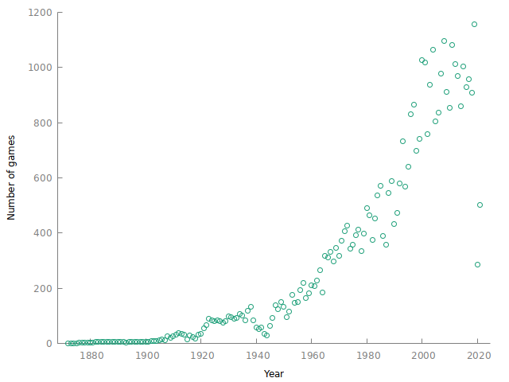
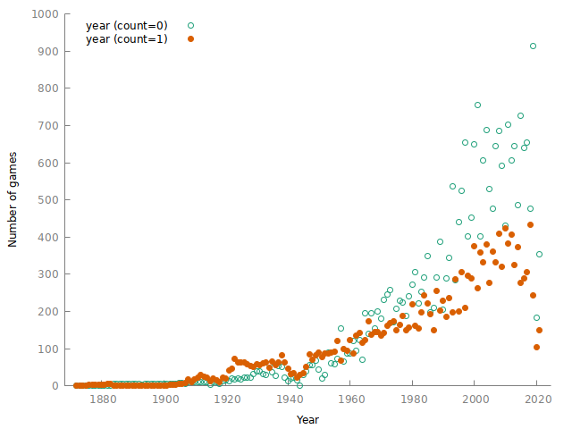
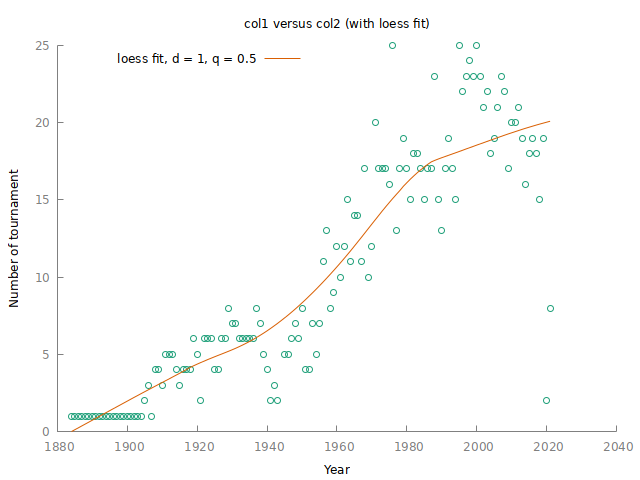
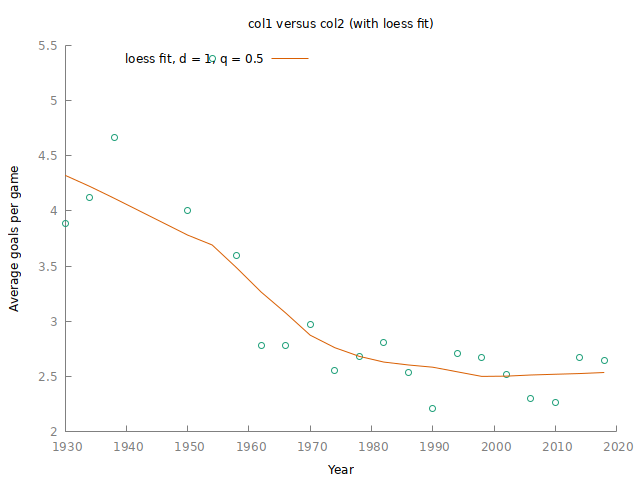
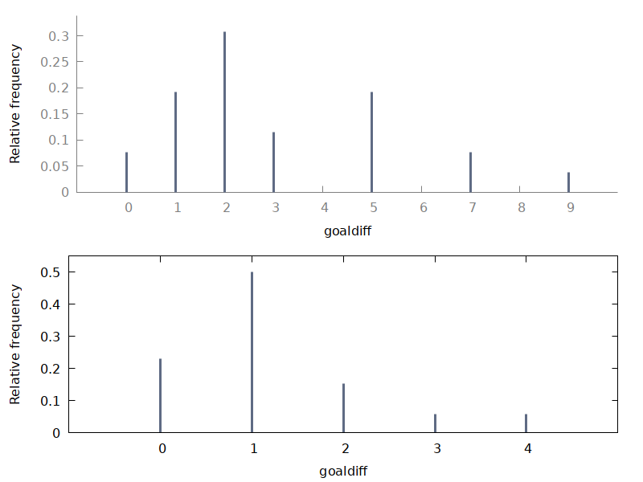

# Introduction
Recently I stumbled over Julius Krumbiegel's nice little data analysis exercise entitled ["Analyzing international football results with Julia"](https://jkrumbiegel.com/pages/2021-06-20-football-data-analysis/). As the title already says, he's using Julia for this task.

The dataset used is cool, and I thought that this may be a nice little exercise to show how to replicate Julius' results using my favourite data tool named *gretl* -- [an open-source statistics and econometrics cross-platform software](http://gretl.sourceforge.net/).


You can find my [repository hosting the script, data and output of this exercise here](https://github.com/atecon/football_results).

# Let's start
I assume that you've a working gretl version installed on your machine. (If you want to compile gretl on your own on an Ubuntu machine -- which don't necessarily need to do -- [see here for my manual](https://github.com/atecon/install_gretl_ubuntu)).

## Initial settings
Let's start with some parameter definitions and setting up the working directory.

**Note**: Replace the `DIR_WORK` parameter by your respective path.

```text
clear
set verbose off
#set datacols 6  # This only works since gretl 2021c

# Parameters
string DIR_WORK = "/home/at/git/football_data"
string URL = "https://raw.githubusercontent.com/martj42/international_results/master/results.csv"
# Alternatively load it from my github-repo:
# string URL = "https://github.com/atecon/football_results/blob/master/data/data_raw.csv"
scalar LOAD_DATA_FROM_WEB = TRUE # only initially needed

# Set the working directory
set workdir "@DIR_WORK"
```

Let's also install and load two 3rd party libraries (for details on the `pkg` command, execute `help pkg`):
```text
# Install necessary package(s) automatically if not available on your local machine
pkg query calendar_utils --quiet
if !nelem($result)
    pkg install calendar_utils
endif
pkg query multiplot --quiet
if !nelem($result)
    pkg install multiplot
endif

include calendar_utils.gfn
include multiplot.gfn
```

On a linux machine you can execute the following command to create two new folders namely `./output` and `./data` within your working directory. In case you use another OS, please create those directories on your own before.

```text
if $sysinfo.os == "linux"
    shell mkdir -p data output
endif
```


## Download the dataset
The data is available as a csv file on github as stated at the beginning. I've already defined the parameter `URL` directing to it.

For loading a csv file and opening it with gretl, we can simply use the `open` command:
```text
if LOAD_DATA_FROM_WEB == TRUE
    # Load the data from the web
    open "@URL" --quiet --preserve --all-cols

    # Store the data locally (just to have it...)
    store "./data/data_raw.csv"
else
	open "./data/data_raw.csv" --preserve --all-cols
endif
```


Let's print the first 10 rows of the dataset:
```text
print --byobs --range=1:10
```

```

                                 home_team                       away_team   home_score   away_score                      tournament

1872-11-30                        Scotland                         England            0            0                        Friendly
1873-03-08                         England                        Scotland            4            2                        Friendly
1874-03-07                        Scotland                         England            2            1                        Friendly
1875-03-06                         England                        Scotland            2            2                        Friendly
1876-03-04                        Scotland                         England            3            0                        Friendly
1876-03-25                        Scotland                           Wales            4            0                        Friendly
1877-03-03                         England                        Scotland            1            3                        Friendly
1877-03-05                           Wales                        Scotland            0            2                        Friendly
1878-03-02                        Scotland                         England            7            2                        Friendly
1878-03-23                        Scotland                           Wales            9            0                        Friendly

                                   city                         country      neutral

1872-11-30                      Glasgow                        Scotland        FALSE
1873-03-08                       London                         England        FALSE
1874-03-07                      Glasgow                        Scotland        FALSE
1875-03-06                       London                         England        FALSE
1876-03-04                      Glasgow                        Scotland        FALSE
1876-03-25                      Glasgow                        Scotland        FALSE
1877-03-03                       London                         England        FALSE
1877-03-05                      Wrexham                           Wales        FALSE
1878-03-02                      Glasgow                        Scotland        FALSE
1878-03-23                      Glasgow                        Scotland        FALSE
```

You can see the columns (variables) -- called *series* in gretl jargon -- the dataset comprises. There is a mix of numerical as well as string-valued series.


## Create some calendar series
For the following tasks its useful to decompose the date string into a series holding the year, month and day, respectively.

To do so, we first apply the `dates_to_iso8601()` function from the "calendar utils" package for casting the date string series into the numerical ISO8601 format.

The built-in `icoconv()` function does the actual decomposition using the integer-valued series `date`:
```text
series date_iso = dates_to_iso8601(date, "%Y-%m-%d")
series year, month, day
isoconv(date_iso, &year, &month, &day)
print date date_iso year month day -o --range=1:5
```

The printout is as follows:
```
   date_string         date         year        month          day

1   1872-11-30     18721130         1872           11           30
2   1873-03-08     18730308         1873            3            8
3   1874-03-07     18740307         1874            3            7
4   1875-03-06     18750306         1875            3            6
5   1876-03-04     18760304         1876            3            4
```


# Let's start with the actual analysis

## Number of games per year
Some initial question might be: How many games were played per year? To answer this question, we need to transform the data by grouping it by the series `year`. A group-by can be done via the `aggregate()` function (execute `help aggregate` or [see here](gretl.sourceforge.net/gretl-help/funcref.html#aggregate) for details) which returns a matrix:

```text
## Count the number of entries (and hence games) per year
matrix gpy = aggregate(year, year)
gpy = mreverse(gpy, TRUE)  # swap the columns
print gpy --range=1:10
```

```
gpy (150 x 2)

       count        byvar
           1         1872
           1         1873
           1         1874
           1         1875
           2         1876
           2         1877
           2         1878
           3         1879
           3         1880
           3         1881
```

The `count` column simply refers to the number of entries of `year` for each `year`, and hence the number of games played.

For plotting, we use gretl's `plot` command. Gretl can plot both series as well as matrices. For details on the plot command, [see here](http://gretl.sourceforge.net/gretl-help/cmdref.html#plot).

Here we plot the columns of matrix `gpy` and store the plot in the `./output` folder created initially:

```text
plot gpy
        options fit=none
        literal set xlabel "Year"
        literal set ylabel "Number of games"
end plot --output="./output/games_per_year.png"
```




The number of games per year has surged since the 1950s.


## Number of games per year grouped by `tournament`
In order to plot the number of games for friendly games and others, respectively, it's useful to compile a so called factorized plot.

For this, we create a binary variable named `friendly` which takes the value 1 for friendly games, and otherwise 0. This factor series can be used as an additional grouping series for the `aggregate` function.

```text
series friendly = (tournament == "Friendly")
print tournament friendly -o --range=1:5

list by = year friendly
matrix gpyf = aggregate(year, by)
print gpyf --range=1:5

```
The output is

```text
                       tournament     friendly

1                        Friendly            1
2                        Friendly            1
3                        Friendly            1
4                        Friendly            1
5                        Friendly            1

gpyf (300 x 3)

        year     friendly        count
        1872            0            0
        1872            1            1
        1873            0            0
        1873            1            1
        1874            0            0
```

The plotting is done as before
```text
# For plotting, re-arrange the column order:
gpyf = gpyf[,{3, 1, 2}] # 3rd column first, 1st col. second etc.

plot gpyf
       options fit=none dummy
       literal set xlabel "Year"
       literal set ylabel "Number of games"
end plot --output="./output/games_per_year_factorized.png"
```

The number of both friendlies and competitions have increased over time, although competitions have risen faster which is may be not too surprising given that these games are commercially more attractive (but this just a hypothesis).




## Number of competitions per year
Next, we want to plot the number of unique tournaments per year. Again we make use of the `aggregate` function. Again we need to group by `year`. However, as the aggregation method we want to count the *unique* occurrences of a type of competition.

As this aggregation method is not supported by gretl, we need to write our own function which I simply call `unique_entries()`.

```text
function scalar unique_entries (const series y)
    /* Aggregation function: Compute the number of unique entries of 'y'
    return: int, number of unique entries. */

    return rows(values(y))
end function
```

This function consumes a series as input, and returns the number of unique values of that series. We can refer to our function `unique_entries()` when calling `aggregate()`.

```text
# Don't consider friendlies
smpl tournament != "Friendly" --restrict --replace

matrix tpy = aggregate(tournament, year, unique_entries)
tpy = mreverse(tpy, TRUE)
tpy = tpy[,{1, 3}]


tpy (137 x 2)
     1   1884
     1   1885
     1   1886
     1   1887
     1   1888
     1   1889
     1   1890
     1   1891
     1   1892
     1   1893
```

The scatter plot with a joint Loess-fit is compiled by:
```text
plot tpy
       options fit=loess dummy
       literal set xlabel "Year"
       literal set ylabel "Number of tournament"
end plot --output="./output/number_of_tournament_per_year.png"
```



As can be seen, the number of competitions has risen over the years with a peak around the year 2000.


## Average number of teams per competition
***Plotting the average number of teams per competition grouped by year and `tournament` is actually not that simple to realize in gretl. We skip this here.***

```text
```


## Number of goals per game
Another interesting question, is how the number of goals per game during the world cups has developed over time.

```text
smpl full
series goals = home_score + away_score
smpl tournament == "FIFA World Cup" --restrict

matrix gpg = aggregate(goals, year, mean)
gpg = gpg[,{3, 1}]

plot gpg
       options fit=loess dummy
       literal set xlabel "Year"
       literal set ylabel "Average goals per game"
end plot --output="./output/avg_goals_per_game.png"
```



The number of goals has been around 4 until the 1950s before stabilizing around 2.5 since the 1970s.


## Frequency plot of goals per game
For this exercise, let's produce two frequency plots: One for the year 1954 and another for 1990.

For compiling a multiplot we make use of the "multiplot" package.

```text
smpl full
series goaldiff = abs(home_score - away_score)
matrix years = {1954; 1990}
strings filenames = array(nelem(years)) # store temporary plot files

loop i=1..rows(years)
    smpl year == years[i] && tournament == "FIFA World Cup" --restrict --replace

    filenames[i] = sprintf("%s/plot$i.gp", $dotdir)
    string fname = filenames[i]

    freq goaldiff --plot="@fname"
endloop

# Compile final plot
multiplot(filenames, "./output/frequency_goal_difference.png")
```



Thus, in 1954 the spread of goals was substantial ranging from zero to even 9(!), indicating that the class between teams really differed. In 1990, most games were decided by one goal difference, in comparison.


## Probability of winning as the home team
Let's compute some helper series first. You also will see how to construct a string-valued series in gretl [using the `stringify()` function](http://gretl.sourceforge.net/gretl-help/funcref.html#stringify).

```text
smpl full
series win = (home_score > away_score) ? 1 : 0
series lose = (home_score < away_score) ? 2 : 0
series tie = (win == 0 && lose == 0) ? 3 : 0

# Create a string-valued series
strings score_labels = defarray("win", "lose", "tie")
series home_result = win + lose + tie
stringify(home_result, score_labels)

smpl home_result home_score away_score --no-missing
print home_result home_score away_score -o --range=1:5


   home_result   home_score   away_score

1          tie            0            0
2          win            4            2
3          win            2            1
4          tie            2            2
5          win            3            0
```

Now compute the relative frequencies

```text
matrix m = aggregate(home_result, home_result)
m[,2] = m[,2]./ $nobs       # compute relative frequencies
rnameset(m, score_labels)

print m

m (3 x 2)

            byvar        count
 win       1.0000      0.48631
lose       2.0000      0.28321
 tie       3.0000      0.23048
```

So, indeed the chance of winning as the home team is almost 50%. This could be a bit misleading, potentially, if the better teams are also somehow the teams that host more games.


Julius' last exercise I am not replicating here but I leave it as an exercise for you.

